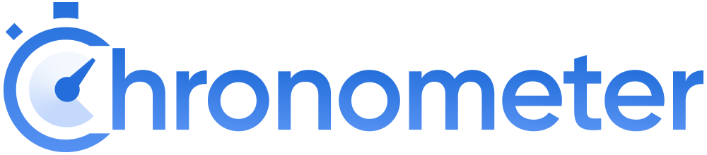

<p align="center">
    
</p>

<p align="center">
    <a href="https://spectrum.chat/phlaknet"></a>
    <a href="https://github.com/users/PHLAK/sponsorship"></a>
    <a href="https://paypal.me/ChrisKankiewicz"></a>
    <br>
    <a href="https://packagist.org/packages/PHLAK/Chronometer"></a>
    <a href="https://packagist.org/packages/PHLAK/Chronometer"></a>
    <a href="https://packagist.org/packages/PHLAK/Chronometer"></a>
    <a href="https://travis-ci.com/PHLAK/Chronometer"></a>
    <a href="https://styleci.io/repos/150507758"></a>
</p>

<p align="center">
    Measure the passing of time --
    by, <a href="https://www.ChrisKankiewicz.com">Chris Kankiewicz</a> (<a href="https://twitter.com/PHLAK">@PHLAK</a>),
    logo by <a href="https://www.twitter.com/Caneco">Caneco</a>
</p>

Introduction
------------

Chronometer is a library for statically measuring the passing of time in your code.
It's intended to be used for benchmarking code execution time.

Requirements
------------

  - [PHP](https://php.net) >= 7.1

Install with Composer
---------------------

```bash
composer require phlak/chronometer
```

Using Chronometer
-----------------

First, import Chronometer.

```php
use PHLAK\Chronometer\Timer;
```

Then start your timer, run your code, stop the timer and get the elapsed time.

```php
Timer::start();
// do something you want to measure...
Timer::stop();

return Timer::elapsed();
```

After running your timer you will need to reset it before using it again.

```php
Timer::reset();
```

You may optionally reset the timer when you start it with the `$reset` parameter.

```php
Timer::start($reset = true);
```

Usage
-----

### start
> Start the timer.

```php
Chronometer\Timer::start( [ $reset = false ] ) : float
```

#### Example

```php
Chronometer\Timer::start(); // Returns something like 1538016612.1692
```

---

### stop
> Stop the timer.

```php
Chronometer\Timer::stop( void ) : float
```

#### Example

```php
Chronometer\Timer::stop(); // Returns something like 1538016632.7721
```

---

### addLap
> Add a new lap.

```php
Chronometer\Timer::addLap( [ string $description = null ] ) : Chronometer\Lap
```

#### Example

```php
$lap = Chronometer\Timer::addLap('The first lap.');

$lap->time // Returns something like 1538016625.492
$lap->duration // Returns something like 7.999922990799
$lap->description // Returns 'The first lap.'
```

---

### started
> Return the timer start time.

```php
Chronometer\Timer::started( void ) : float
```

#### Example

```php
Chronometer\Timer::started(); // Returns something like 1538016612.1692
```

---

### stopped
> Return the timer stop time.

```php
Chronometer\Timer::stopped( void ) : float
```

#### Example

```php
Chronometer\Timer::stopped(); // Returns something like 1538016632.7721
```

---

### elapsed
> Return the total time elapsed in seconds.

```php
Chronometer\Timer::elapsed( void ) : float
```

#### Example

```php
Chronometer\Timer::elapsed(); // Returns something like 20.602929115295
```

---

### lastLap
> Return the last lap.

```php
Chronometer\Timer::lastLap( void ) : Chronometer\Lap
```

#### Example

```php
$lap = Chronometer\Timer::lastLap();

$lap->time // Returns something like 1538016632.7721
$lap->duration // Returns something like 7.2800490856171
```

---

### laps
> Return an array of all laps.

```php
Chronometer\Timer::laps( void ) : array
```

#### Example

```php
Chronometer\Timer::laps(); // Returns an array of Lap objects
```

---

### reset
> Reset the timer state.

```php
Chronometer\Timer::reset( void ) : void
```

#### Example

```php
Chronometer\Timer::reset();
```

---

Changelog
---------

A list of changes can be found on the [GitHub Releases](https://github.com/PHLAK/Chronometer/releases) page.

Troubleshooting
---------------

For general help and support join our [Spectrum community](https://spectrum.chat/phlaknet).

Please report bugs to the [GitHub Issue Tracker](https://github.com/PHLAK/Chronometer/issues).

Copyright
---------

This project is licensed under the [MIT License](https://github.com/PHLAK/Chronometer/blob/master/LICENSE).
